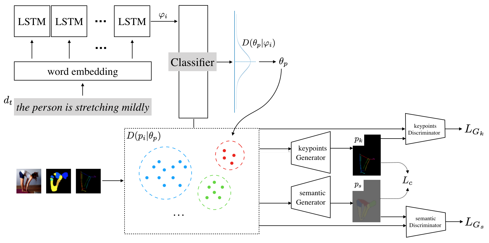

### Human Pose Synthesis on Large Scale of Human Activity
This is a project for COMS 4995 Deep Learning. We propose a new task, which is text guided pose synthesis on large scale of human activities. We first analyze the state-of-the-art model for pose keypoints estimation, the power of human semantic parsing, and existing text guided image synthesis. Further, we proposed an approach that can solve our target task with 3 stages. We then talked about the potential improvement and drawbacks of our model.

## Contributors
* [Yue Wan](https://github.com/yuewan2)
* [Guandong Liu](https://github.com/NarakuF)

## Requirements
Install all dependencies in `requrements.txt`.

[pytorch-ssim](<https://github.com/Po-Hsun-Su/pytorch-ssim>) should also be installed for cgan training.

## Contents
* `data`: processed MPII data and data path csv.
* `intermediate`: directory for preprocessed data and pretrained models.
* `model`: implementation of various neural networks, including annotation classifier, and conditional GAN.
* `output`: sample results for synthesized pose keypoints and semantic parsing.
* `utils`: some helper methods to process images and texts.
* `data_clustering.py`: k-means clustering algorithm for images.
* `pose_dataset.py`: customized dataset and dataloader using PyTorch.
* `test.py`: test code to run the whole pipeline.
* `train*.py`: training code for different neural networks.

## Testing
Download our preprocessed data, pretrained classifier, generators, and discriminators model from [google drive](<https://drive.google.com/drive/folders/1hT0OZFhEyrAF2SRYJjBsSojfxb9sQXX8?usp=sharing>) and put them inside the `./intermediate` folder. Run `python3 test.py` for testing. It will allow you to enter a brief annotation (no longer than 15 words) and generate the corresponding pose and semantic parsing.

## References and Related Projects
* [Unsupervised Person Image Generation with Semantic Parsing Transformation](<https://github.com/SijieSong/person_generation_spt>)
* [OpenPose](<https://github.com/CMU-Perceptual-Computing-Lab/openpose>)
* [Detectron2](<https://github.com/facebookresearch/detectron2>)
* [LIP_JPPNet](<https://github.com/Engineering-Course/LIP_JPPNet>)
* [pytorch-ssim](<https://github.com/Po-Hsun-Su/pytorch-ssim>)
* [PyTorch-GAN](<https://github.com/eriklindernoren/PyTorch-GAN>)
* [vae-torch](<https://github.com/ldeecke/vae-torch>)
* More references are cited in the project report.
